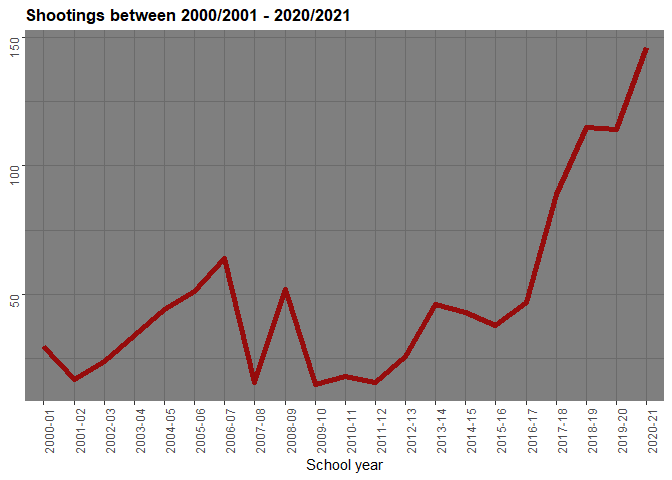
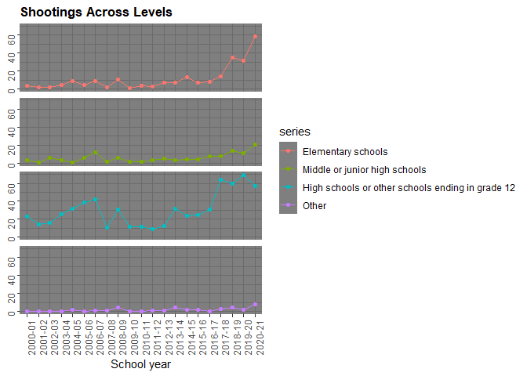
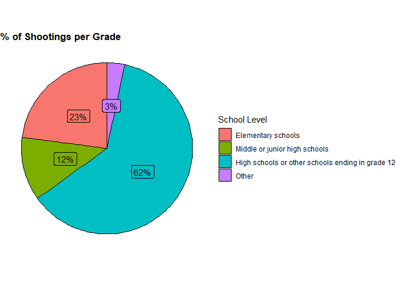
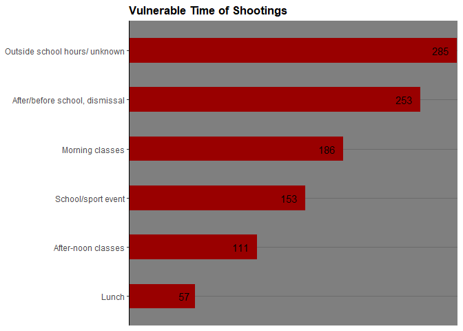
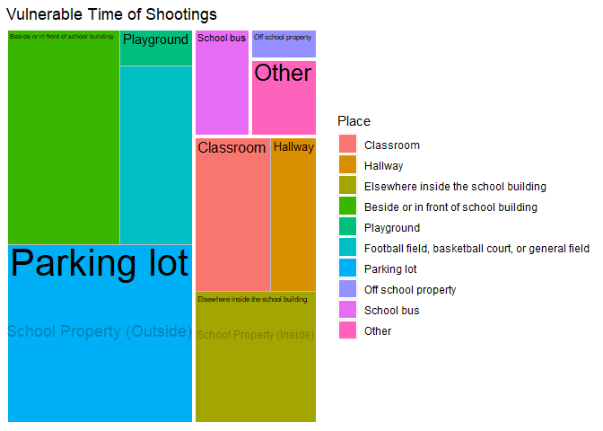
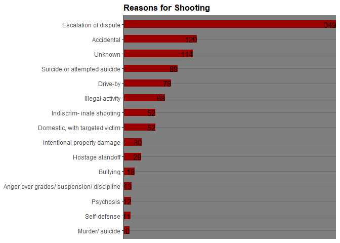
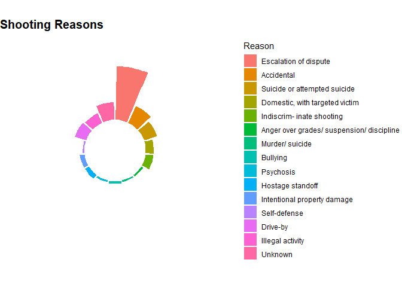
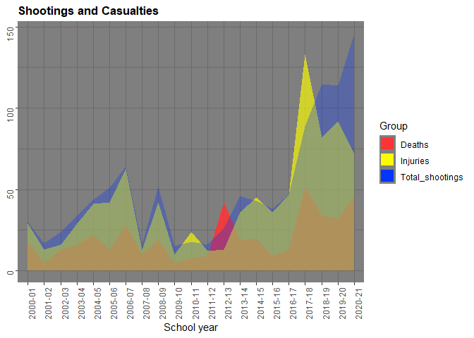
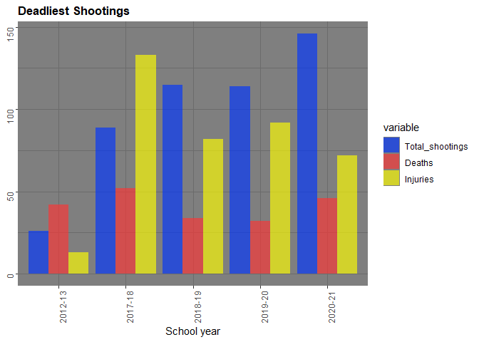

US School Shootings
================
Mega
2022-10-14

INTRODUCTION

This is an Exploratory Data Analysis for School shootings in the US from
2000 to 2021

As defined by the Congressional Research Service, mass shootings are
multiple firearm-related homicides involving at least four victims at
one or more nearby locations. Foreign terrorists are not included.

Every day in America, 12 children die and 32 are injured because of gun
violence, according to the Sandy Hook foundation. A foundation formed
after the deadly shooting at Sandy Hook Elementary School in 2012.
Throughout the last few decades, gun violence has been growing in the
United States. This has caused a lot of protests and foundations to
spring up. As a data analyst enthusiast, I examined one of many datasets
regarding gun violence for insight.

1.Aim

The aim of this project is to get valuable and meaningful insight into
school shootings over the year.

2.Preparation

2.1 Data used Datasets were downloaded from Kaggle. In these datasets,
locations, times, reasons, and casualties of school shootings are
recorded. Excel had been used to clean up and sort data sets into
different xlsx files.

2.2 Information Data is organised as wide data with details relating to
the different school years recorded, 21 school years in total.

Files include: Casualties from shootings Number of school shootings, by
type of casualty school shooting-by location school shooting-situation
associated Shootings by level(grade) of school

2.3 Credibility

•Reliable: Data can be considered reliable considering the source and
the acknowledgements of the data. •Original: The data set is not
original as it was collated from another source, so it’s a secondary
source. •Comprehensive: The data is very comprehensible with each column
properly labelled. •Current: Data was last updated 3 months ago; it is
therefore considered current.

2.4 Verification

As stated earlier, excel was used to filter, sort and separate data into
different files. I was able to verify the attributes of the data set.

3 Process

3.1 Installing Packages Installing the Packages needed for Analysis

``` r
library(ggpubr)
```

    ## Loading required package: ggplot2

``` r
library(tidyverse)
```

    ## ── Attaching packages
    ## ───────────────────────────────────────
    ## tidyverse 1.3.2 ──

    ## ✔ tibble  3.1.7     ✔ dplyr   1.0.9
    ## ✔ tidyr   1.2.0     ✔ stringr 1.4.0
    ## ✔ readr   2.1.2     ✔ forcats 0.5.1
    ## ✔ purrr   0.3.4     
    ## ── Conflicts ────────────────────────────────────────── tidyverse_conflicts() ──
    ## ✖ dplyr::filter() masks stats::filter()
    ## ✖ dplyr::lag()    masks stats::lag()

``` r
library(here)
```

    ## here() starts at C:/Users/megae/Documents/Personal Data Analysis/US-School-Shootings

``` r
library(skimr)
library(janitor)
```

    ## 
    ## Attaching package: 'janitor'
    ## 
    ## The following objects are masked from 'package:stats':
    ## 
    ##     chisq.test, fisher.test

``` r
library(lubridate)
```

    ## 
    ## Attaching package: 'lubridate'
    ## 
    ## The following objects are masked from 'package:base':
    ## 
    ##     date, intersect, setdiff, union

``` r
library(ggrepel)
library(readr)
library(readxl)
library(ggplot2)
library(hrbrthemes)
```

    ## NOTE: Either Arial Narrow or Roboto Condensed fonts are required to use these themes.
    ##       Please use hrbrthemes::import_roboto_condensed() to install Roboto Condensed and
    ##       if Arial Narrow is not on your system, please see https://bit.ly/arialnarrow

``` r
library(reshape2)
```

    ## 
    ## Attaching package: 'reshape2'
    ## 
    ## The following object is masked from 'package:tidyr':
    ## 
    ##     smiths

``` r
library(shadowtext)
library(treemapify)
```

3.2 Importing Data sets The school shooting data sets were imported
using R studio files

``` r
casualties <- read_excel("C:/Users/megae/Documents/Personal Data Analysis/School shooting/School shootings/Cleaned data/Casualties from shootings.xlsx")

shootings <- read_excel("C:/Users/megae/Documents/Personal Data Analysis/School shooting/School shootings/Cleaned data/Number of school shootings, by type of casualty.xlsx")

shooting_location <- read_excel("C:/Users/megae/Documents/Personal Data Analysis/School shooting/School shootings/Cleaned data/school shooting-by location.xlsx")


school_shooting_level <- read_excel("C:/Users/megae/Documents/Personal Data Analysis/School shooting/School shootings/Cleaned data/Shootings by level of school.xlsx")


shooting_situation <- read_excel("C:/Users/megae/Documents/Personal Data Analysis/School shooting/School shootings/Cleaned data/school shooting-situation associated.xlsx")
```

3.3 Preview Dataset “head” function is used to preview the data.

``` r
head(casualties)
```

    ## # A tibble: 6 × 4
    ##   `School year` Total Deaths Injuries
    ##   <chr>         <dbl>  <dbl>    <dbl>
    ## 1 2000-01          47     18       29
    ## 2 2001-02          18      5       13
    ## 3 2002-03          29     13       16
    ## 4 2003-04          45     16       29
    ## 5 2004-05          63     22       41
    ## 6 2005-06          55     13       42

Description Of Casualties School year : Year of shooting Total: Total
number of casualties including injuries and deaths Deaths: number of
persons killed in shootings Injuries: number of persons injured in
shootings

``` r
head(shootings)
```

    ## # A tibble: 6 × 5
    ##   `School year` Total `Number with deaths` `Number with injur…` `Number with n…`
    ##   <chr>         <dbl>                <dbl>                <dbl>            <dbl>
    ## 1 2000-01          30                   16                    7                7
    ## 2 2001-02          17                    5                    8                4
    ## 3 2002-03          24                   12                    7                5
    ## 4 2003-04          34                   12                   16                6
    ## 5 2004-05          44                   12                   27                5
    ## 6 2005-06          51                   12                   30                9

Description Of Shootings School year : Year of shooting Total: Total
number of Shootings per year Number with Deaths: Shootings that had at
least 1 death Number with Injuries: Shootings that had at least 1
injured person only Number with no casualties: Shootings with no
injuries or deaths

``` r
head(shooting_location)
```

    ## # A tibble: 6 × 17
    ##   `School year` Classroom Hallway `Elsewhere insid…` `Beside or in …` Playground
    ##   <chr>             <dbl>   <dbl>              <dbl>            <dbl>      <dbl>
    ## 1 2000-01               8       2                  6                4          0
    ## 2 2001-02               3       3                  3                4          1
    ## 3 2002-03               4       3                  7                4          0
    ## 4 2003-04               7       1                  4                8          1
    ## 5 2004-05               5       5                  5               11          1
    ## 6 2005-06               6       7                  8                9          1
    ## # … with 11 more variables:
    ## #   `Football field, basketball court, or general field` <dbl>,
    ## #   `Parking lot` <dbl>, `Off school property` <dbl>, `School bus` <dbl>,
    ## #   Other <dbl>, `Morning classes` <dbl>, `After-noon classes` <dbl>,
    ## #   Lunch <dbl>, `After/before school, dismissal` <dbl>,
    ## #   `School/sport event` <dbl>, `Outside school hours/ unknown` <dbl>

Description Of Shootings_location School year : Year of shooting
Locations of shootings (e.g Classroom) Period of shootings (e.g Morning
class)

``` r
head(school_shooting_level)
```

    ## # A tibble: 6 × 5
    ##   `School year` `Elementary schools` `Middle or junior …` `High schools …` Other
    ##   <chr>                        <dbl>                <dbl>            <dbl> <dbl>
    ## 1 2000-01                          4                    3               23     0
    ## 2 2001-02                          2                    1               14     0
    ## 3 2002-03                          2                    6               16     0
    ## 4 2003-04                          5                    3               26     0
    ## 5 2004-05                          9                    1               32     2
    ## 6 2005-06                          5                    6               39     0

Description Of school_shooting_level School year : Year of shooting
Grade of school in shootings

``` r
head(shooting_situation)
```

    ## # A tibble: 6 × 16
    ##   `School Year` `Escalation of di…` Accidental `Suicide or at…` `Domestic, wit…`
    ##   <chr>                       <dbl>      <dbl>            <dbl>            <dbl>
    ## 1 2000-01                         5          3                5                0
    ## 2 2001-02                         5          3                1                1
    ## 3 2002-03                         5          2                7                1
    ## 4 2003-04                        11          4                3                2
    ## 5 2004-05                        18          9                2                2
    ## 6 2005-06                        26          7                2                1
    ## # … with 11 more variables: `Indiscrim- inate shooting` <dbl>,
    ## #   `Anger over grades/ suspension/ discipline` <dbl>, `Murder/ suicide` <dbl>,
    ## #   Bullying <dbl>, Psychosis <dbl>, `Hostage standoff` <dbl>,
    ## #   `Intentional property damage` <dbl>, `Self-defense` <dbl>,
    ## #   `Drive-by` <dbl>, `Illegal activity` <dbl>, Unknown <dbl>

Description Of Shootings_situation School year : Year of shooting
Situataion associated: reason for shooting

3.4 Cleaning Previous cleaning was done using excel, to separate and
rename columns.

4.Analyze and Visualize Data sets

4.1 Shootings occurring in the past years Here I would look to analyse
the trend of school shooting occurrences since the school year 2000/2001

``` r
shootings %>% 
  ggplot(aes(x = `School year`, y = Total, group = 1)) +
  geom_line(color = "#990000", size = 2, alpha = 0.9) + 
  ggtitle("Shootings between 2000/2001 - 2020/2021") +
  theme_dark() + 
  theme(plot.title = element_text(size = 13, face = "bold"),axis.text = element_text(angle = 90), axis.title.y = element_blank()) 
```

<!-- -->
From the visual above, there is one very noticeable period

The steady increase in Shooting frequency from 2011/12 to 2020/21, just
after a steady low rate of school shootings for 3 school years. School
years 2009/10, 2010/11, and 2011/12 had the lowest numbers of school
shootings in the dataset, but this period is then followed by an
ever-increasing frequency of school shootings till the present.

The increase in shootings after this period can be attributed to the
District of Columbia v. Heller 2008 hearing where the Supreme court
reinterpreted the 2nd Amendment from the long-time state right to
maintain militia to an individual right to own guns, This caused an
increase in gun ownership in the US and the eventual increase in annual
gun deaths.

This however conflicts with the low number of shootings for 3 years just
after the Heller hearing. With further research, I discovered a report
by senior data journalist Daniel Dunford reporting that from 2008 to
2012, there were over 200,000 more background checks for gun sales than
the previous years.

4.2 School shootings by grade

``` r
#converting School shooting level data into a long format to plot school level on the same graph

school_level <- school_shooting_level 

school_level <- melt(school_level, id.vars = 'School year', variable.name = 'series')


#Visualizing data
  ggplot(school_level, aes(x= `School year`, y = `value`, group = 1)) + 
    geom_point(aes(color = series)) +
  geom_line(aes(color = series))+
  facet_grid(series ~ .) + 
  ggtitle("Shootings Across Levels") +
  theme_dark() + 
  theme(plot.title = element_text(size = 13, face = "bold"),axis.text = element_text(angle = 90))+ 
   theme(strip.text.y = element_blank(), axis.title.y = element_blank())
```

<!-- -->

``` r
  #Calculating percentage shooting by School level
  school_level_percent <- school_level %>%
  select(series, value) %>%
    group_by(series) %>%
  summarise(total = sum(value)) %>%
  mutate(Level_percent_total = total/sum(total))%>%
  group_by(series) %>%
  mutate(labels = scales::percent(Level_percent_total)) %>%
  arrange(desc(Level_percent_total)) %>%
  rename("% Of Shootings" = labels)%>%
  select(series, Level_percent_total,`% Of Shootings`)


#Visualizing graph
school_level_percent %>%
  ggplot(aes("",Level_percent_total, fill = series ))+
  geom_col(color = "black") +
  coord_polar(theta = "y") + 
  geom_label(aes(label = `% Of Shootings`), position = position_stack(vjust = 0.5),show.legend = FALSE)+
  guides(fill = guide_legend(title = "School Level")) +
  theme_void()+
  ggtitle("% of Shootings per Grade") +
  theme(plot.title = element_text(size = 13, face = "bold"))
```

<!-- -->

``` r
view(school_level_percent)
```

From observations, most shootings in the dataset occur in Hschoolshool
with the second most shootings occurring in elementary schools.

High School Average age: 17-18 Elementary school Average age: 5-11

4.3 Vulnerable Times of Shootings

Here, I look to detect the most vulnerable time of shooting occurrences

``` r
##selecting time of shooting from data set and making the data frame long then to wide for easier plotting

shooting_time <- shooting_location %>%
  select(`School year`, `Morning classes`, `After-noon classes`, Lunch, `After/before school, dismissal`, `School/sport event`, `Outside school hours/ unknown`) 
  

# making the data frame long
shooting_time <- melt(shooting_time, id.vars = 'School year', variable.name = 'period')

  
#Plotting data frame  
shooting_time %>%
  pivot_wider( names_from = "School year", values_from = "value") %>%
  replace(is.na(.), 0) %>%
  mutate('Total Shootings' = rowSums(.[2:22])) %>% 
  select(period, `Total Shootings`) %>%
  arrange(desc(`Total Shootings`)) %>%
  ggplot(aes(x = reorder(period, `Total Shootings`), `Total Shootings`)) +
  geom_bar(stat = "identity", fill = "#990000", width = .5) +
  geom_text(aes(label = `Total Shootings` ),hjust=1.5) +
  coord_flip() +
  ggtitle("Vulnerable Time of Shootings") +
  theme_dark() +
  scale_y_discrete(expand = expansion(add = c(0, 0.5))) +
  theme( axis.line.y.left = element_line(color = "black")) + 
  theme(plot.title = element_text(size = 13, face = "bold")) + 
  theme(axis.title = element_blank())
```

<!-- -->
Analysis shows the majority of school shootings occur during
non-teaching hours, like classes as the shooter would most likely seek
to inflict the most damage to people. Outside school hours, after/before
school sporting events are times when there are groups around chatting
and playing which makes it the most vulnerable time for mass shootings.

4.4 Vulnerable places of attack In the occurrence of a school shooting,
I look at the places not to be caught in, places with a high frequency
of shootings. (Most likely to be attacked by a shooter).

``` r
shooting_area <- shooting_location %>%
  select(`School year`, Classroom, Hallway, `Elsewhere inside the school building`, `Beside or in front of school building`, Playground, `Football field, basketball court, or general field`, `Parking lot`, `Off school property`, `School bus`, Other)


shooting_area <- melt(shooting_area, id.vars = 'School year', variable.name = 'Place')


shooting_area %>%
  pivot_wider( names_from = "School year", values_from = "value") %>%
  mutate(Area = case_when(
    Place == 'Classroom' ~ "School Property (Inside)",
    Place == 'Hallway' ~ "School Property (Inside)",
    Place == 'Elsewhere inside the school building' ~ "School Property (Inside)",
    Place == 'Beside or in front of school building' ~ "School Property (Outside)",
    Place == 'Playground' ~ "School Property (Outside)",
    Place == 'Football field, basketball court, or general field' ~ "School Property (Outside)",
    Place == 'Parking lot' ~ "School Property (Outside)",
    Place == 'Off school property' ~ "Off school property",
    Place == 'School bus' ~ "School Bus",
    Place == 'Other' ~ "Other")) %>%
  replace(is.na(.), 0) %>%
  mutate('Shootings' = rowSums(.[2:22])) %>% 
  select(`Place`, `Shootings`, Area) %>%
  group_by(`Place`) %>%
  arrange(desc(`Shootings`))%>%
  ggplot(aes(area = `Shootings`, fill = `Place`, label = `Place`, subgroup = Area)) +
  geom_treemap()+
  ggtitle("Vulnerable Time of Shootings") +
  geom_treemap_text(Place = "centre", grow = TRUE)+
  geom_treemap_subgroup_border(colour = "white", size = 4.4)+
  geom_treemap_subgroup_text(Place = "centre", padding.y = grid::unit(25, "mm"), grow = TRUE,alpha = 0.25, colour = "black")
```

    ## Warning: Ignoring unknown parameters: Place
    ## Ignoring unknown parameters: Place

<!-- -->
From the insight gotten revealing the most vulnerable time of school
shootings is outside school hours, it is no surprise that the most
vulnerable place of attack is outside school buildings on the school’s
property. This data however could be misleading as it does not
specifically tell if this is where the shootings started, ended, or
recorded the most casualties.

4.5 Reasons for shootings

The database creator’s description of the motive of shooters is seen
below

• Accidental: No intent to fire the weapon (e.g., showing off gun and it
went off; gun in backpack went off).

• Anger Over Grade/Suspension/Discipline: Primarily targeted teacher or
school administrator due to poor grades, suspension, expulsion, or
discipline. Also includes a school employee who targeted a school
administrator or co-worker following poor performance evaluation,
suspension, or loss of employment.

• Bullying: Bullied by the victim(s) and did not indiscriminately target
random students.

• Domestic w/ Targeted Victim: Had a romantic or familial relationship
with the victim or victim was in a romantic relationship with a former
lover of the shooter

• Drive-by: Shots fired by a person in a vehicle at people, or another
vehicle, on school property.

• Escalation of Dispute: Physical or verbal altercation between the
shooter and victim prior to the shooting or retaliation for a prior
altercation or attack (e.g., during a fight between multiple students,
one of the students involved pulled out a handgun and fired; following
an argument earlier in the day, a student shot the other student that
he/she argued within the school parking lot).

• Hostage/Standoff: A standoff at the school between a shooter and law
enforcement with or without hostages taken. Hostages may have been
released without injury and/or no shots were fired during the standoff

• Illegal Activity: Shots were fired during a robbery, sale or exchange
of illegal drugs, trespassing, theft of property, or exchange of stolen
property.

• Indiscriminate: Targeted random victims with the intent to kill or
injure as many as possible (e.g., fired into a crowd; shot students in
the hallway and random classrooms).

• Intentional Property Damage: Shots were fired to cause damage to the
school building or vehicles on school property without intent to cause
injury.

• Psychosis: Described as disconnected from reality and exhibiting
symptoms of a severe psychotic episode, or having paranoid schizophrenia
stated in open-source reports (e.g., shooter believed the school was
sending mind control signals or part of a government conspiracy).

• Murder/Suicide: Shot targeted victim and then immediately killed self
(including other bystanders who were struck by gunfire but were not
intended targets).

• Officer Involved Shooting: A police officer, SRO, or armed security
guard was the only person to fire a weapon.

• Racial: Shooters targeted victims based on race.

• Self-Defence: Shooter fired in self-defence or defence of someone
else.

• Suicide/Attempted: Suicide or attempted suicide by a shooter who was
the only victim (not an indiscriminate shooting or revenge/bullying
where the shooter kills themself during the shooting).

• Unknown

``` r
shooting_reason <- shooting_situation

  
shooting_reason <- melt(shooting_reason, id.vars = 'School Year', variable.name = 'Reason')


shooting_reason %>%
  pivot_wider( names_from = "School Year", values_from = "value") %>%
  replace(is.na(.), 0) %>%
  mutate('Total' = rowSums(.[2:22])) %>% 
  select(Reason, `Total`) %>%
  ggplot(aes(x = reorder(Reason, `Total`), `Total`)) +
  geom_bar(stat = "identity", fill = "#990000", width = .5) +
  geom_text(aes(label = `Total` ),hjust=1) +
  coord_flip() +
  ggtitle("Reasons for Shooting") +
  theme_dark() +
  scale_y_discrete(expand = expansion(add = c(0, 0.5))) +
  theme( axis.line.y.left = element_line(color = "black")) + 
  theme(plot.title = element_text(size = 13, face = "bold")) + 
  theme(axis.title = element_blank())
```

<!-- -->
By a long distance, Escalation of the dispute seems to be the greatest
reason for school shootings to occur with murder/suicide being the least

Another visual of the Reason for shooting plot is seen below.

``` r
shooting_reason %>%
  pivot_wider( names_from = "School Year", values_from = "value") %>%
  replace(is.na(.), 0) %>%
  mutate('Total' = rowSums(.[2:22])) %>% 
  select(Reason, `Total`) %>%
  tibble::rowid_to_column("index") %>% #add index to data
  arrange(desc(`Total`))%>%
  ggplot(aes(x=as.factor(index), y= Total, fill= Reason)) +
  geom_bar(stat="identity")+
   ylim(-200,400) +
   theme_minimal() +
  theme(
    axis.text = element_blank(),
    axis.title = element_blank(),
    panel.grid = element_blank(),
    plot.margin = unit(rep(-0.1,4), "cm"))+
   coord_polar(start = 0) +
  ggtitle("Shooting Reasons") + 
  theme(plot.title = element_text(size = 15, face = "bold"))
```

<!-- -->

4.6 Catastrophic Shooting Years

Ranking catastrophic shooting years can be tricky. Do you rank according
to deaths, total casualties or number of shootings that occurred in the
year.

I would then rank deadliest according to total casualties and
destructive years

``` r
Worst_shootings <- casualties %>%
  mutate(Total_shootings = shootings$Total) # create a column with the total number of shootings per year


Worst_shootings %>% 
  ggplot() +
  geom_area(aes(x = `School year`, y = Deaths,  group = 1, fill = "Deaths"), size = 2, alpha = 0.88,) +
  geom_area(aes(x = `School year`, y = Injuries, group = 1, fill = "Injuries"), size = 2, alpha = 0.65) +
  geom_area(aes(x = `School year`, y = Total_shootings, group = 1, fill = "Total_shootings"), size = 2, alpha = 0.3) + 
    scale_fill_manual(name = "Group",
                      values = c("Deaths" = "#FF3333", "Injuries" = "#FFFF00",  "Total_shootings" = "#0033FF"), labels = c("Deaths", "Injuries","Total_shootings"  )) +
   ggtitle("Shootings and Casualties") +
  theme_dark() + 
  theme(plot.title = element_text(size = 13, face = "bold"),axis.text = element_text(angle = 90), axis.title.y = element_blank()) 
```

<!-- -->

School year with the most deaths: 2020/21 2017/18 2012/13

Casualty Count: 2017/18 2019/20 2020/21

Shootings: 2020/21 2019/20 2018/19

2017 to 2021 has seen a rise in the number of school shootings and has
been on the rise since which has also led to an increase in casualties.
The 2012/13 school year is an anomaly as it’s the only year where the
number of deaths recorded surpassed the number of persons injured and
the number of total shootings.

With an increase in school shootings in the past years, it can be stated
that the US is not closer to solving its gun crisis as more shootings
and protests against gun laws occur more frequently.

``` r
Deadliest_shootings <- Worst_shootings %>%
  select(`School year`, Deaths, Injuries, Total_shootings) %>%
  filter(Deaths > 30)

top_deadliest_shootings <- melt(Deadliest_shootings[,c("School year","Total_shootings","Deaths",  "Injuries")],id.vars = 1)


top_deadliest_shootings %>%
  ggplot(aes(x = `School year`, y = value, fill = variable )) + 
  geom_bar(position = "dodge", stat = "identity", alpha = 0.65) +
  scale_fill_manual(values = c("#0033FF",
                                "#FF3333",
                                "#FFFF00"))+
  ggtitle("Deadliest Shootings") +
  theme_dark() + 
  theme(plot.title = element_text(size = 13, face = "bold"),axis.text = element_text(angle = 90), axis.title.y = element_blank()) 
```

<!-- -->

I tried to dissect the shootings and filter down our selections to
shooting years that resulted in a death count of more than 30.

Recent years have seen the deadliest shootings, with the deadly school
shooting year of 2012/13 still in the spotlight.
